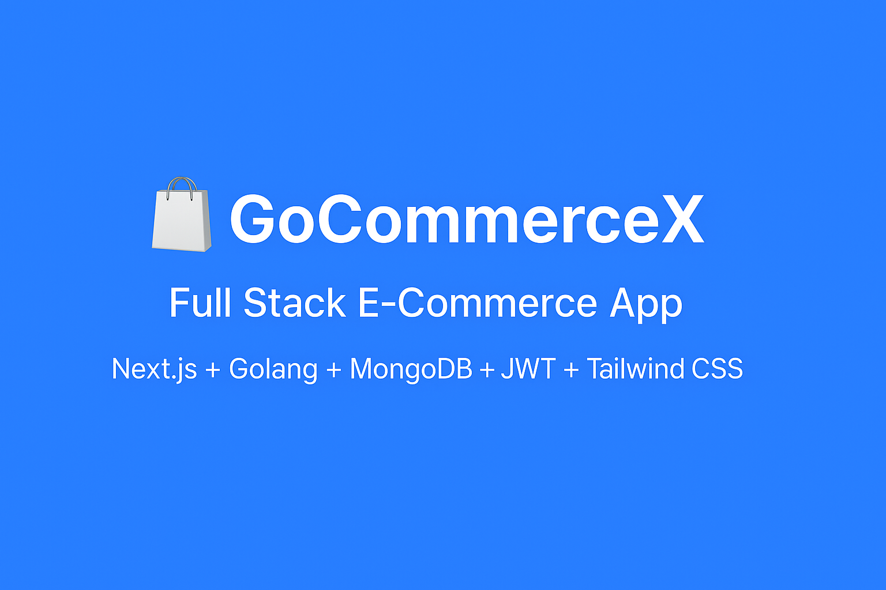

# 🛍️ GoCommerceX

**Full Stack E-commerce Application built with Next.js, Golang (Gin), and MongoDB**  
A complete shopping platform with user authentication, admin panel, product CRUD, and image uploads.  

🚀 **Tech Stack:**  
`Next.js` • `React` • `Golang (Gin)` • `MongoDB` • `JWT Auth` • `Tailwind CSS`

---

## 📸 Preview



*(Add your banner image above — create one in Canva with the title “GoCommerceX — Full Stack E-Commerce App”)*

---

## ✨ Features

### 🧑‍💻 User Features
- 🔐 **Signup / Login** with JWT authentication  
- 👤 **Session management** (Login/Logout)  
- 🛒 **View products** with name, description, image, and price  
- 💬 **Responsive design** — works on desktop & mobile  

### 🧑‍💼 Admin Features
- 🧾 **Admin Dashboard** with authentication  
- 🧱 **Add / Edit / Delete Products (CRUD)**  
- 🖼️ **Image Uploads** (via `/upload` API endpoint)  
- 🚫 **Protected Routes** using middleware (`AuthMiddleware` + `AdminMiddleware`)  

---

## ⚙️ Tech Architecture

Frontend: Next.js (React + Tailwind CSS)
Backend: Golang (Gin Framework)
Database: MongoDB (Atlas)
Auth: JWT (JSON Web Tokens)
Uploads: Local file storage (/uploads)

yaml
Copy code

---

## 🧭 Folder Structure

gocommerce/
│
├── backend/
│ ├── config/ # MongoDB connection setup
│ ├── controllers/ # All API logic (user, product, upload)
│ ├── middleware/ # JWT, Auth & Admin Middleware
│ ├── models/ # Database Schemas
│ ├── routes/ # API Endpoints
│ └── main.go # Entry point
│
└── frontend/
├── src/
│ ├── app/ # Next.js App Router
│ ├── components/ # Navbar, ProductCard, etc.
│ └── pages/ # Home, Login, Signup, Product Detail, Admin Dashboard
├── public/
└── package.json

pgsql
Copy code

---

## 🧩 API Endpoints

### 🔑 Authentication
| Method | Endpoint | Description |
|--------|-----------|-------------|
| POST | `/signup` | Register new user |
| POST | `/login` | User login (returns JWT) |

### 🛍️ Products
| Method | Endpoint | Description |
|--------|-----------|-------------|
| GET | `/products` | Get all products |
| GET | `/products/:id` | Get single product |
| POST | `/admin/products` | Add new product (Admin only) |
| PUT | `/admin/products/:id` | Update product (Admin only) |
| DELETE | `/admin/products/:id` | Delete product (Admin only) |

### 🖼️ Uploads
| Method | Endpoint | Description |
|--------|-----------|-------------|
| POST | `/upload` | Upload product image |

---

## 🧠 How to Run Locally

### 1️⃣ Backend Setup
```bash
cd backend
go mod tidy
go run main.go
Server runs on 👉 http://localhost:8080

2️⃣ Frontend Setup
bash
Copy code
cd frontend
npm install
npm run dev
Frontend runs on 👉 http://localhost:3000

🧑‍💻 Developer Info
👨‍💻 Developer: Pankaj Upadhyay
📧 Email: upadhayay.pankaj1986@gmail.com
💼 GitHub: github.com/pu1986

🏗️ Deployment (Optional)
Frontend: Deploy on Vercel

Backend: Deploy on Render or Railway

Database: Use MongoDB Atlas

📜 License
This project is licensed under the MIT License.

⭐ If you like this project, give it a star on GitHub!
Your support motivates open-source developers 🙌

